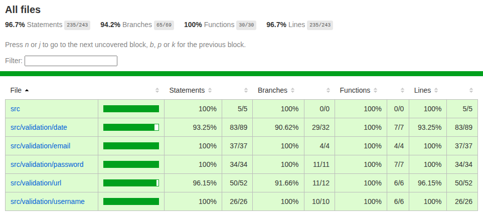

# Tests

Unit tests has been created for each validator in this module using **Vitest** and can be found in the src/_\_tests__/ folder. A summary of the test results can be found at the end of the Tests section.

## Running the tests

`npm run test`

## Test requirements

### Date validator
 
* Positive testing
  * Valid Short format date
  * Valid Long format date
  * Valid ISO format date

* Negative testing
  * Day number over 31 or under 1.
  * Month number over 12 or under 1.
  * Year number under 1.
  * Month name in long format spelt wrong.
  * Date doesn't exist (e.g February 31).
  * No comma in long date.

| Method | Test | Result |
|---|---|---|
| isValidISODate() | Unit test | PASS |
| isValidShortDate() | Unit test | PASS |
| isValidLongDate() | Unit test | PASS |
| isValidDate() | Unit test | PASS |

---

### E-mail validator
 
* Positive testing
  * Valid E-mail string.

* Negative testing
  * Too short top level domain name.
  * Invalid characters.
  * Consecutive allowed special character.
  * Doesn't contain "@" character.

| Method | Test | Result |
|---|---|---|
| isValidEmail() | Unit test | PASS |

---

### Password validator
 
* Positive testing
  * Valid password string.
  * Contains lower case letter.
  * Contains upper case letter.
  * Contains number.
  * Contains special character.
  * Valid password string length.

* Negative testing
  * Too short password.
  * Doesn't contain lower case letter.
  * Doesn't contain upper case letter.
  * Doesn't contain number.
  * Doesn't contain special character.

| Method | Test | Result |
|---|---|---|
| isValidPassword() | Unit test | PASS |
| hasValidLength() | Unit test | PASS |
| containsNumber() | Unit test | PASS |
| containsLowerCaseLetter() | Unit test | PASS |
| containsUpperCaseLetter() | Unit test | PASS |
| containsSpecialCharacter() | Unit test | PASS |

---

### URL validator
 
* Positive testing
  * Valid URL string.

* Negative testing
  * Consecutive periods in hostname.
  * Too long hostname.
  * Too long port number.
  * Invalid protocol.

| Method | Test | Result |
|---|---|---|
| isValidUrl() | Unit test | PASS |

---

### Username validator
 
* Positive testing
  * Valid username string.

* Negative testing
  * Consecutive allowed special characters.
  * Too long username.
  * Too short username.
  * Invalid characters.

| Method | Test | Result |
|---|---|---|
| isValidUrl() | Unit test | PASS |

## Test results summary

